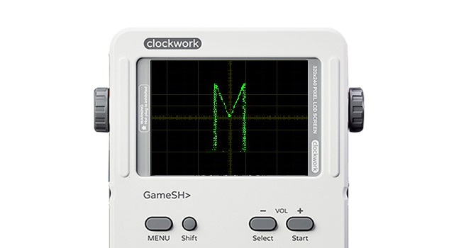

## Oscillofun

Oscilloscope music for GameShell

<p align="center">
    <a href="">
        
    </a>
</p>

### Requirements

```shell
pip3 install -r requirements.txt
```

**Note: If requirements do not install successfully, please do it manually by installing whl file** 

### Install

make a directory in GameShell

```shell
mkdir /home/cpi/launcher/Menu/GameShell/11_Oscillofun
```

clone source code to GameShell

```git
cd /home/cpi/launcher/Menu/GameShell
git clone https://github.com/WangTingZheng/oscillofun 11_Oscillofun
```

refreash lanucher in GameShell thought exeuting reload app

### Play

execute Oscillofun app in lanuncher, you will see a video likes displaying wave in Oscilloscope

### Refences

[Occillofun: a magical audio, which can be viewed on the oscilloscope with download link]([https://www.bilibili.com/video/av862814](https://www.bilibili.com/video/av862814))
